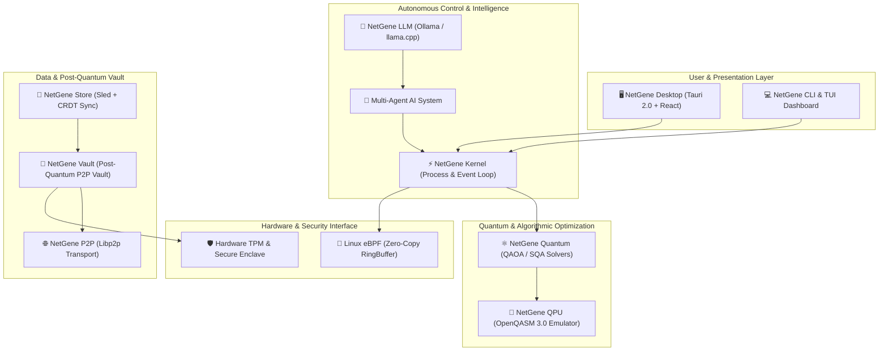

# NetGene OS 🧬
### *Living · Self-Evolving · Quantum-Enhanced Distributed Operating System*

[](https://www.rust-lang.org/)
[](https://tauri.app/)
[](https://ebpf.io/)
[](https://qiskit.org/)
[](LICENSE)

---

## 🌟 Executive Overview / Visão Geral

**NetGene OS** is a next-generation distributed operating system architecture engineered completely in **Rust**. Operating at the **1.0.0 Apex Megastructure** tier, NetGene OS bridges low-level Linux eBPF networking, post-quantum cryptographic vaults, local LLM multi-agent decision loops, and simulated quantum optimization (QAOA/SQA) into a cohesive, self-healing system.

> **Português**: NetGene OS é um sistema operacional distribuído auto-evolutivo e otimizado por algoritmos pós-quânticos. Desenvolvido em 21 Crates em Rust, integra eBPF, agentes autônomos locais, armazenamento distribuído CRDT e interface gráfica moderna em Tauri + React.

---

## 🏗️ System Architecture / Arquitetura do Sistema



---

## 📦 21 Crates Architecture / Estrutura de Crates

NetGene OS is strictly organized into **21 specialized Rust crates** for maximum parallelism, safety, and modularity:

| Crate | Category | Responsibilities & Technology |
| :--- | :--- | :--- |
| `netgene-kernel` | **Core** | Microkernel process scheduler, memory pool & event loops |
| `netgene-agent` | **AI** | Multi-agent autonomous lifecycle & infrastructure decision loop |
| `netgene-llm` | **AI** | Local inference bridge for Ollama, llama.cpp & quantized models |
| `netgene-quantum` | **Quantum** | QAOA (Quantum Approximate Optimization Algorithm) & SQA solvers |
| `netgene-qpu` | **Quantum** | Hardware accelerator interface & OpenQASM 3.0 execution engine |
| `netgene-ebpf` | **Network** | Linux kernel zero-copy packet filter & eBPF XDP hookloader |
| `netgene-p2p` | **Network** | Distributed peer discovery, libp2p multiplexing & Kademlia DHT |
| `netgene-store` | **Storage** | High-performance KV store (Sled) & CRDT state synchronization |
| `netgene-vault` | **Security** | Post-quantum lattice encryption & secret zeroization |
| `netgene-tpm` | **Security** | Hardware TPM 2.0 attestation & Secure Enclave key generation |
| `netgene-safeguard`| **Resilience**| Autonomous system health check & self-healing circuit breakers |
| `netgene-builder` | **Tooling** | Cross-compilation pipeline & release packaging engine |
| `netgene-cli` | **Interface** | Command line control interface & interactive terminal shell |
| `netgene-tui` | **Interface** | Terminal UI dashboard powered by `ratatui` |
| `netgene-desktop` | **Interface** | Desktop GUI app built with Tauri 2.0, Vite, React & Tailwind |

---

## 🔥 Key Highlights & Features

- **🚀 100% Memory Safe Rust Architecture**: No garbage collection overhead, guaranteed thread safety and zero-cost abstractions.
- **🤖 Autonomous Infrastructure Decisions**: Local LLM agents analyze network throughput and deploy dynamic firewall rules automatically.
- **⚛️ Post-Quantum & Quantum-Ready**: Combines Kyber/Dilithium post-quantum cryptography with QAOA routing solvers.
- **🐧 Linux eBPF Native Filtering**: Inspects and filters packets at the XDP network driver level before reaching kernel stack.
- **🔄 Fault-Tolerant CRDT Replication**: State is distributed across nodes seamlessly without central points of failure.

---

## 💻 Quickstart & Local Execution / Como Executar

### Prerequisites
- [Rust & Cargo](https://rustup.rs/) (1.80+ recommended)
- [Node.js](https://nodejs.org/) (v18+ for Desktop GUI)
- [CCompiler / Build Tools] (gcc/clang on Linux, MSVC on Windows)

### 1. Seed Synthetic Telemetry Data
```bash
cargo run -p netgene-cli -- seed data
```

### 2. Run the Terminal Dashboard (TUI)
```bash
cargo run -p netgene-tui
```

### 3. Launch Desktop GUI (Tauri + React)
```bash
cd netgene-desktop
npm install
npm run tauri dev
```

---

## 🛡️ Security & Privacy Assurance

NetGene OS is designed with **Privacy-First & Zero-Trust Architecture**:
- All cryptographic keys remain strictly inside local Hardware TPMs or post-quantum vaults.
- Telemetry & LLM inferences execute **100% locally** (no remote tracking or secret leaks).
- Repository contains **zero hardcoded API keys or credentials**.

---

## 📄 License

Distributed under the **MIT License** and **Apache License 2.0**. See `LICENSE` for details.
