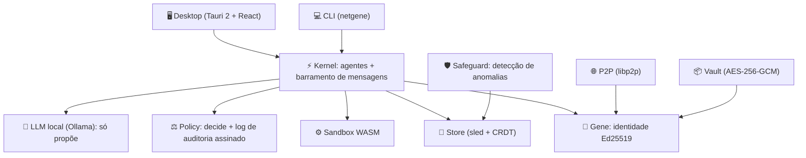

# NetGene OS 🧬

### A camada de confiança para agentes de IA: identidade criptográfica, permissões verificáveis e execução isolada, numa malha privada entre os seus dispositivos.

[](https://mnemosyne-one.com)
[](#licença)
[](#estado-real-de-cada-módulo)

> **Alpha (v0.7.0).** O LLM só **propõe**: um motor de políticas decide, e cada decisão fica num log de auditoria assinado. Identidades, manifestos, módulos WASM, tokens e o log são assinados de forma **híbrida pós-quântica**, e as mensagens privadas entre nós usam **X25519 + ML-KEM-768**. As capacidades podem ser delegadas com **tokens que expiram e podem ser revogados**, e as confirmações podem exigir **Windows Hello**. Os plugins WASM só recebem as **permissões que declaram e assinam**. O NetGene OS ainda não passou por auditoria externa. A tabela [Estado real](#estado-real-de-cada-módulo) diz exatamente o que funciona e quais limites continuam.

---

## Por que o NetGene existe

Agentes de IA estão ganhando acesso a arquivos, redes, chaves e APIs. Hoje quase nenhum deles tem uma identidade própria, um limite claro do que pode fazer ou um registro auditável do que fez. Esse é o problema que o NetGene quer resolver:

| Quem | O que ganha |
|---|---|
| **Usuário final** | Um assistente de IA local que roda nos seus dispositivos (PC, notebook e, no futuro, celular), sem nuvem de terceiros. Cada agente só faz o que você autorizou. |
| **Desenvolvedores** | Um runtime para publicar agentes e plugins WASM assinados, com permissões declaradas, que qualquer pessoa pode instalar com segurança. |
| **Empresas e big techs** | Uma camada auto-hospedada de identidade e política para frotas de agentes: cada ação é atribuída a uma identidade, limitada por capacidades e registrada, sem depender de um fornecedor. |

**O diferencial:** a proposta não é ser mais uma VPN mesh (NetBird, Tailscale e Nebula já fazem isso bem), nem mais um framework de agentes. O NetGene é a peça que falta entre os dois. É a camada que diz **quem** é cada agente, **o que** ele pode fazer e **onde** ele pode rodar.

---

## Arquitetura


```mermaid
graph TD
    UI["🖥️ Desktop (Tauri 2 + React)"] --> K
    CLI["💻 CLI (netgene)"] --> K
    K["⚡ Kernel: agentes + barramento de mensagens"] --> LLM["🧠 LLM local (Ollama): só propõe"]
    K --> POL["⚖️ Policy: decide + log de auditoria assinado"]
    K --> W["⚙️ Sandbox WASM"]
    K --> S["💾 Store (sled + CRDT)"]
    K --> G["🔑 Gene: identidade Ed25519"]
    P["🌐 P2P (libp2p)"] --> G
    V["📦 Vault (AES-256-GCM)"] --> G
    SG["🛡️ Safeguard: detecção de anomalias"] --> S
```

Mais detalhes em [netgene-core/docs/ARCHITECTURE.md](netgene-core/docs/ARCHITECTURE.md).

---

## Estado real de cada módulo

✅ funciona · 🧪 experimental (funciona em parte, com limitações conhecidas) · ⛔ não use para dados reais

| Crate | Estado | O que faz de verdade | Limitação conhecida |
|---|---|---|---|
| `netgene-gene` | ✅ | Identidades **híbridas Ed25519 + ML-DSA-65** (FIPS 204) com **linhagem assinada pelas duas chaves**. Há uma primitiva de assinatura híbrida que liga a chave pública aos bytes assinados (remover a parte pós-quântica invalida também o Ed25519). **Capability tokens**: delegação de capacidades com janela de validade, assinada, revogável e sem escalada de privilégio. As chaves privadas ficam no **cofre do sistema**, nunca em disco. | A implementação ML-DSA (`ml-dsa` da RustCrypto) ainda não tem auditoria independente, e por isso é usada sempre em modo híbrido. Genes antigas continuam só Ed25519. |
| `netgene-policy` | ✅ | **O LLM propõe, a política decide.** Catálogo de ações com capacidade e risco, motor de políticas (`allow` / `confirm` / `deny`, regras em `~/.netgene/policy.json`, limites de parâmetros, capacidades vindas de tokens válidos) e **log de auditoria append-only**, encadeado por SHA3 e com assinatura híbrida, em `~/.netgene/audit.jsonl`. Ele pode ser **exportado para SIEM** em **OCSF** ou **CEF** (`agent audit --export`). | O catálogo ainda é pequeno (4 ações). |
| `netgene-enterprise` | ✅ | **OIDC:** um ID token corporativo (Okta, Entra ID, Keycloak…) é verificado contra o JWKS do IdP (só RS256/ES256; `iss`, `aud` e `exp` conferidos), e os grupos viram capacidades num capability token com prazo (`gene grant-oidc`, mapeamento em `~/.netgene/enterprise.json`). A concessão fica registrada no log de auditoria. | SAML ainda não é suportado. O JWKS por URL é buscado a cada concessão (sem cache). |
| `netgene-ebpf` | ✅ (Linux) | **eBPF real:** um programa XDP em C, compilado com clang e carregado com `aya`, conta pacotes e bytes por IP de origem sem nunca derrubar tráfego. `ebpf watch` alimenta o detector do Safeguard. | Só Linux, como root (ou `CAP_BPF` + `CAP_NET_ADMIN`). Por enquanto só IPv4. |
| `netgene-presence` | 🧪 | **Confirmação com hardware:** com `"require_user_presence": true`, uma ação só é confirmada com uma assinatura do **Windows Hello** (chave RSA-2048 no TPM, que só assina após PIN ou biometria) sobre aquela proposta exata. | Só no Windows por enquanto (macOS Touch ID e WebAuthn/passkeys no celular estão previstos). O prompt real do Windows Hello ainda precisa ser testado à mão. |
| `netgene-p2p` | ✅ | Nó libp2p 0.57: TCP + Noise + Yamux, Gossipsub assinado com validação estrita, mDNS e Kademlia. O **PeerId é derivado da Gene**, e só entram nós da mesma linhagem (allowlist com chaves fixadas). As **mensagens privadas** passam por uma sessão **híbrida X25519 + ML-KEM-768** (handshake com assinatura híbrida das duas Genes, ChaCha20-Poly1305 com contador anti-replay). | O gossip (broadcast) continua só autenticado sobre o Noise clássico. Não há NAT traversal. |
| `netgene-store` | ✅ | Banco local **redb** (arquivo único, ACID, puro Rust) em `~/.netgene/store.redb`, para nós, eventos (em ordem cronológica) e memória de agentes, com registrador CRDT LWW. Uma base `sled` antiga é migrada automaticamente uma vez. | A dependência `sled` fica só para a migração e sai na próxima versão. |
| `netgene-llm` | ✅ | Cliente Ollama (chat/generate) e parser de intenções com fallback por regras. | Modelo e URL fixos (`llama3`, `localhost:11434`). |
| `netgene-kernel` | 🧪 | 5 agentes em tasks Tokio e barramento de mensagens. Cada intenção passa pelo motor de políticas: leituras rodam na hora, mudanças esperam confirmação humana e o que está fora da política é negado. Inclui o marketplace local com **manifestos assinados** e **reputação**: avaliações assinadas, presas à versão exata do agente, em que só contam revisores da sua linhagem (resistente a Sybil). Uma avaliação por revisor, autoavaliações descartadas e média bayesiana. | Os agentes ainda são simples (o "provisionamento" é só uma mensagem para os agentes, sem infraestrutura real por trás). |
| `netgene-safeguard` | 🧪 | Detecção de anomalias por z-score em janela deslizante. | As ações de "self-healing" são apenas registradas, não executadas. |
| `netgene-wasm` | ✅ | **Executa** módulos com assinatura híbrida de um autor confiável (a chave tem de bater exatamente, incluindo a parte pós-quântica), com wasmtime 36 LTS, limite de CPU (fuel) e de memória. **Permissões declaradas e assinadas** (`log`, `io`, `kv`, `clock`): só são linkadas as funções de host das permissões que o módulo declara **e** que o sandbox concede (`--allow`), e qualquer outro import é recusado. Não há WASI, rede nem sistema de arquivos. | O KV é por execução (o chamador decide se o persiste). Não há permissão de rede por design. |
| `netgene-vault` | 🧪 | Cifra arquivos em pedaços com AES-256-GCM. A chave fica no cofre do sistema e **sobrevive a reinícios**. Cada pedaço é ligado ao arquivo, à posição e ao total (AAD). | Só local: ainda não há replicação entre dispositivos. Arquivos de versões ≤ 0.3 não podem ser lidos (a chave antiga se perdia). |
| `netgene-desktop` | 🧪 | Painel de nós, eventos, agentes, marketplace (assina com uma Gene local), vault e terminal de intenções com botões **Confirmar/Rejeitar**. Age como a Master Gene local. **Também roda no Android** (Tauri mobile): as chaves ficam cifradas por uma chave do **Android Keystore**, e os dados ficam no diretório privado do app. | Sem autenticação local (passkeys reais estão previstos). O APK ainda não foi publicado, e iOS não foi testado. |
| `netgene-cli` | ✅ | Comandos `gene` (init, spawn, verify, export, import, grant, tokens, revoke-token, enroll-presence), `agent` (dispatch `--gene` [`--confirm`], audit, policy, publish, market), `store`, `llm`, `p2p`, `wasm` (sign, run) e `vault`. | — |

**Removido na versão 0.3.0:** os módulos quântico/QAOA, QPU, BCI neural, DAO, TPM, eBPF, Kubernetes, IoT lite, cloud mesh, builder, TUI e o "FHE". Eles eram simulados (valores fixos ou verificações que sempre aceitavam) e davam garantias que não existiam. O histórico do git preserva o código. Alguns podem voltar quando houver uma implementação real (por exemplo, eBPF com `aya` ou TPM com `tss-esapi`). O motivo de cada remoção está em [AUDITORIA_2026-10.md](AUDITORIA_2026-10.md).

---

## Como executar

**Pré-requisitos:** [Rust](https://rustup.rs/) estável (testado com 1.94), [Node.js](https://nodejs.org/) 20+ para o desktop e, opcionalmente, [Ollama](https://ollama.com/) com o modelo `llama3`.

```bash
cd netgene-core
cargo test --workspace
```

```bash
cargo run -p netgene-cli -- gene init --name minha-identidade
```

```bash
cargo run -p netgene-cli -- p2p listen --gene <ID-da-gene> --port 7777
```

O ID aparece em `gene init`. Outros nós entram se forem sub-genes da mesma Master (`gene spawn`, depois `gene export` e `gene import` no outro dispositivo).

```bash
cd netgene-desktop && npm install && npm run tauri dev
```

**Auto-hospedado** (nó headless, chaves no cofre cifrado em arquivo): veja [deploy/docker-compose.yml](deploy/docker-compose.yml) e [deploy/netgene-node.service](deploy/netgene-node.service). Defina `NETGENE_SECRET_STORE=file` e `NETGENE_SECRET_PASSPHRASE_FILE`.

---

## Roadmap

O plano completo está em [ROADMAP.md](ROADMAP.md). Resumo:

1. **Fase 0 (concluída):** higiene do repositório, CI funcional, licença e documentação honesta.
2. **Fase 1 (concluída, v0.4.0):** chaves no cofre do sistema, vault persistente e autenticado, WASM assinado e executado de fato, marketplace assinado, P2P com identidade Gene e allowlist.
3. **Fase 2 (concluída, v0.7.0):** motor de políticas, log de auditoria, identidade e assinaturas híbridas, capability tokens, Windows Hello, runtime WASM com permissões, sessões ML-KEM no P2P e `redb`.
4. **Fase 3 (concluída, v0.8.0):** reputação no marketplace, OIDC, exportação SIEM, deploy auto-hospedado, eBPF real e app **Android** com as chaves no Android Keystore.

---

## Segurança

O NetGene OS ainda não passou por auditoria de segurança externa. Use com cautela antes disso. Para reportar uma vulnerabilidade, abra uma *security advisory* privada no GitHub em vez de uma issue pública.

## Licença

Distribuído sob [MIT](LICENSE-MIT) **ou** [Apache-2.0](LICENSE-APACHE), à sua escolha.
